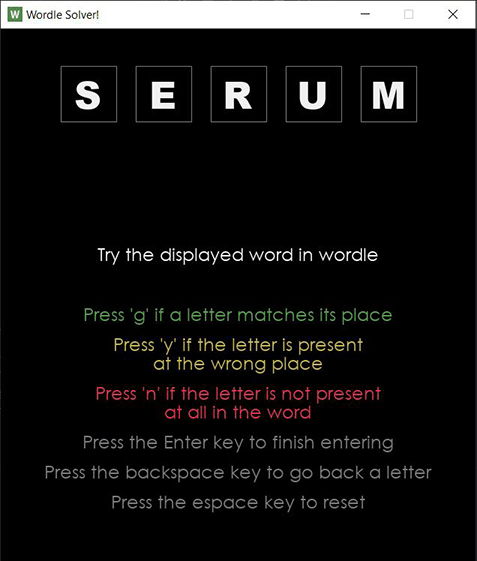
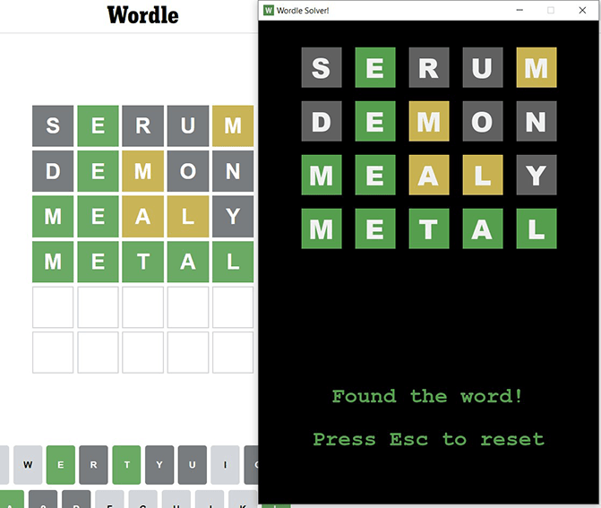

# Wordle Solver
Suggest words to solve the popular word game 'Wordle'

- Suggests words based on previous guesses
- Can run in GUI based mode or command line
- Update win-loss statistics after every run to update success rates

## Requirements
- Python 3.xx

## Usage
1. Run the program in python
    - Run `solver-gui.py` for the GUI version, or
    - Run `wordle.py` for the command line version
2. Enter the *correctness* input after each suggestion
    - Enter *'g'* for green, *'y'* for yellow or *'n'* for none, corresponding to the feedback the Wordle app gives
    - Press enter after giving inputs for all five letters to get a new suggession based on your inputs
3. Press `Esc` key to reset the game state in the GUI version

- To disable statistics, set the `ENABLE_STATS` variable to `False` in `solver-gui.py`
- If you would like the program to start from a particular word, set the `__INITIAL_SUGGESTION__` variable to a 5 letter word in `wordle.py`

## Screenshots

